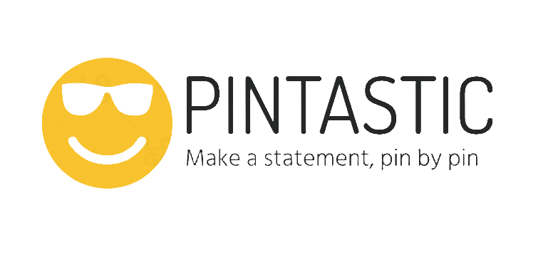
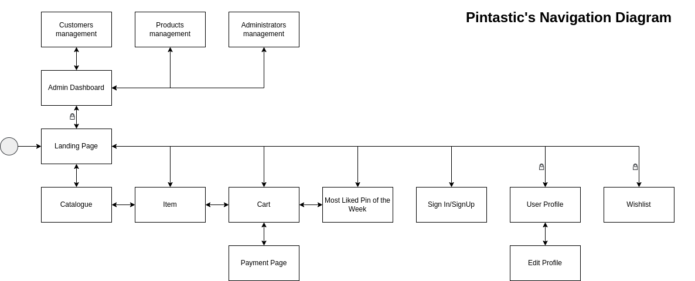

  

# SCC0219 Pintastic: a fully-functional Online Store to sell button pins.

Group project for SCC0219 Introduction to Web Development Course @ ICMC-USP.

## Membros:

- Pedro Kenzo Muramatsu Carmo (11796451)
- Ana Cristina Silva de Oliveira (11965630)
- André Santana Fernandes (112081537)

## Requisitos

- O sistema possui 2 tipos de usuários: Clientes e Administradores.
  - Os administradores gerenciam o sistema, os usuários e os produtos oferecidos (pins e adesivos).
  - O registro de um administrador ocorre após seu cadastro no  sistema fornecendo dados pessoais obrigatórios como: nome completo, email e senha.  
    Os demais campos, como endereço, serão opcionais. Logo após, enviamos em seu email os dados para login no sistema: email@pintastic.com e senha única.
  - Os usuário são clientes que acessam a aplicação para a compra de pins e adesivos.
- O registro de cada cliente inclui: nome completo, email, senha, endereço de entrega e telefone para contato.
- Os registros dos pins e adesivos incluem: ID, nome do produto, categoria, preço de venda e quantidade em estoque.
- Vendas de pins e adesivos: O produto é selecionado, a quantidade é escolhida e incluída no carrinho. Os produtos são comprados utilizando dados de cartão de crédito (qualquer número é aceito pelo sistema), boleto ou PIX. A quantidade vendida de pins/adesivos é subtraída da quantidade em estoque. O carrinho é esvaziado somente após o pagamento ou retirada manual pelo cliente.
- Gerenciamento de pins/adesivos: Administradores devem ser capazes de criar, atualizar, ler e deletar (CRUD) novos pins e adesivos. Por exemplo, mudar a quantidade de produtos em estoque.
- O sistema deve conter requisitos de accessibilidade e prover boa usabilidade para o cliente.

### Funcionalidade extra: Pin do Dia

* Todos os dias, os clientes podem acessar uma tela chamada  **Pin do dia** , na qual um dos pins que o cliente gostou da loja (ou seja, algum dos itens do seu 'wishlist') será sorteado e terá um desconto especial naquele dia.

## Descrição do projeto
- O projeto desenvolvido trata-se de uma loja de pins e adesivos colecionáveis de diversas categorias, como Brasil, arquitetura, folclore, animes e séries. As funcionalidades apresentadas no tópico anterior foram organizadas da seguinte forma:

- A partir de todas as páginas é possível acessar a **Landing Page**.
- O usuário pode realizar login/cadastro na página de **Sign In / Sign Up**.
- Após logado, o cliente pode editar as informações cadastradas em seu perfil através da página **Edit Profile** e possuir um pin em sua Wishlist que poderá ser sorteado para o **Pin do Dia**.
- A todo momento é possível acessar a página de carrinho (**Cart**) através do ícone presente no cabeçalho.
- A todo momento é possível acessar a página de catálogo (**Catalogue**) através do ícone presente no cabeçalho.
- Quando logado em uma conta de administrador, será possível acessar a página **Admin Page** através de um botão que estará presente no dropdown ao passar com o mouse sobre o nome de usuário logado presente no canto superior direito da tela. Dessa forma, na página do administrador será possível acessar todas as funcionalidades voltadas aos administradores.
- Além disso, como admin poderá visitar as páginas de **Customers Management** e **Products Management** para modificações dos produtos selecionados.

### Informações armazenadas no servidor
- Informações sobre os usuários-clientes: nome completo, email, senha, endereço de entrega e telefone para contato.
- Informações sobre os administradores: nome completo, email, senha e endereço (opcional).
- Informações sobre pins e adesivos: ID, nome do produto, categoria, preço de venda e quantidade em estoque.
- Informações sobre o Pin do Dia: nome do pin sorteado de cada usuário, data e valor de desconto.

## Comentários sobre o código
- O arquivo de estilização CSS está dividido em sessões para cada parte essencial das páginas. Essa divisão é feita de forma simples através de comentários que explicitam o inicio e fim dos blocos de código de cada página. Vide exemplo abaixo:

- Como cada página possui componentes diferentes, adicionamos os arquivos referentes a estes no diretório **milestone-1/components**. Para os arquivos **.css** que são comuns aos arquivos, armazenamos na pasta **milestone-1/utils**. Por fim, os arquivos **.html** e **.css** relacionados estão no diretório **milestone-1/**.

## Plano de testes
A seguir estão listados os testes que iremos realizar:
1) Busca de pin/adesivo por nome
    - Buscar por um pin/adesivo no catálogo por meio de uma string de busca a partir da barra de pesquisa presente no cabeçalho do site.
2) Filtragem por categoria
    - Verificar retorno ao selecionar uma categoria de pin/adesivo na barra de navegação do cabeçalho.
3) Navegação nas diferentes páginas do catálogo
    - Verificar se a barra de navegação do cabeçalho funciona conforme esperado.
4) Adicionar item ao carrinho
    - Verificar se o botão de **Adicionar ao carrinho** presente na página do pin/adesivo e catálogo funciona conforme esperado.
5) Wishlist
    - Verificar se o botão de **Adicionar à Wishlist** presente na página do pin/adesivo, catálogo e página do carrinho funciona conforme esperado.
6) Remover um item do carrinho
    - Na página do carrinho testar se o item será removido ao clicar no botão **Remove**
7) Testar a máscara de input em alguns dos campos presentes no site
8) Testar funcionalidade de edição de carta quando logado como Administrador
9) Testar inclusão de cartas e usuários por parte do administrador
10) Testar alteração de perfil por parte do usuário
11) Testar finalização de compra após itens serem adicionados ao carrinho.

## Resultados dos testes

## Procedimentos de build

### Tutorial de Build

## Comentários e agradecimentos
